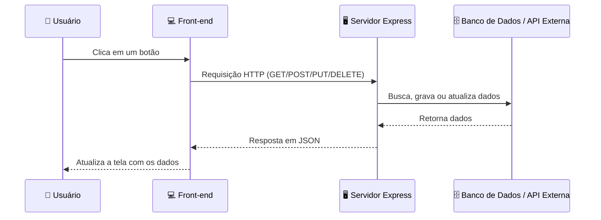
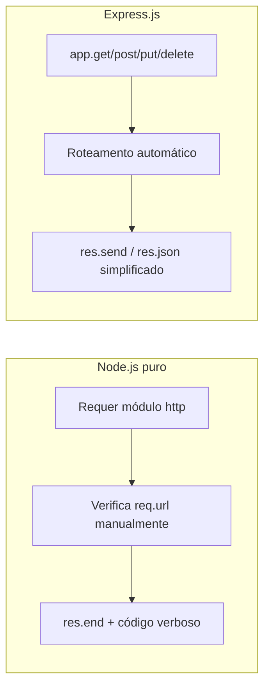
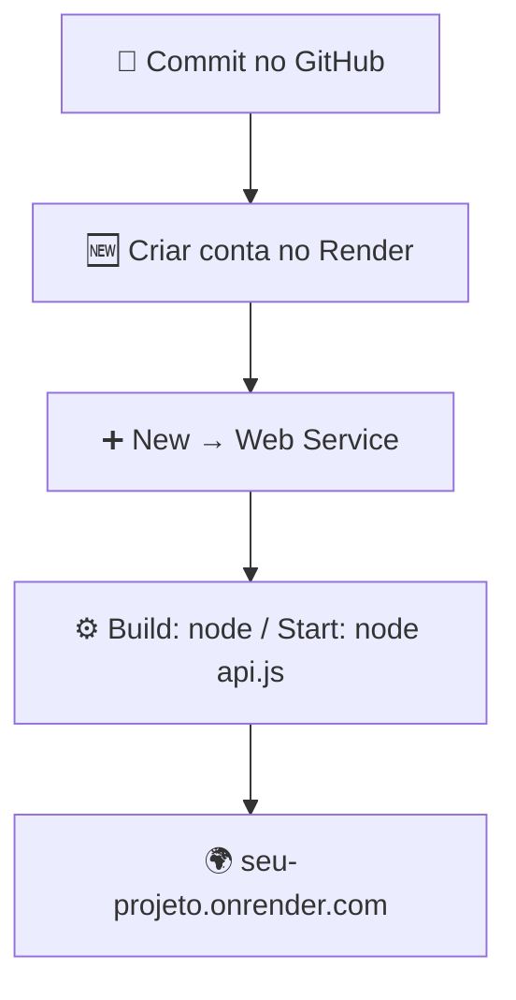

# 🌐 Consumindo APIs no Front-end


**Professor:** Me. Deivison S. Takatu
**Contato:** deivison.takatu@edu.senai.br

---

## 📑 Índice

1. [O que é uma API](#-o-que-é-uma-api)
2. [Protocolo HTTP](#-protocolo-http)
3. [Métodos HTTP](#-métodos-http)
4. [Fluxo de uma requisição](#-fluxo-de-uma-requisição)
5. [EndPoint](#-endpoint)
6. [Repositórios de APIs públicas](#-repositórios-de-apis-públicas)
7. [JSON](#-json)
8. [Servidor Backend e Web Service](#-servidor-backend-e-web-service)
9. [Framework Express.js](#-framework-expressjs)
10. [Node.js puro vs Express.js](#-nodejs-puro-vs-expressjs)
11. [Deploy com Render](#-deploy-com-render)
12. [Atividades propostas](#-atividades-propostas)
13. [Referências](#-referências)

---

## 🧩 O que é uma API

> [!NOTE]
> Uma **API (Application Programming Interface)** é um conjunto de protocolos, rotinas e ferramentas para construção de software. Ela define como diferentes componentes de software devem interagir, permitindo que sistemas distintos se comuniquem entre si.

O estilo arquitetural mais usado na web é o **REST** (*Representational State Transfer*):

- 🔁 Comunicação cliente-servidor **stateless**
- 🌍 Uso padronizado de métodos HTTP
- 🔗 Recursos identificados por **URIs**
- 📦 Representações de dados (geralmente **JSON**)

---

## 🔌 Protocolo HTTP

O **HTTP** (*Hypertext Transfer Protocol*) é o protocolo que permite a comunicação na Web, estabelecendo as regras para troca de informações entre clientes e servidores.

| Conceito | Descrição |
|---|---|
| 🖥️ Modelo cliente-servidor | O navegador (cliente) faz requisições a servidores web |
| 🚫 Stateless | Cada requisição é independente — o servidor não guarda memória da anterior |
| 📖 Baseado em texto | As mensagens são legíveis por humanos |

---

## 📮 Métodos HTTP

| Método | Ícone | Finalidade | Idempotente? |
|---|---|---|---|
| `GET` | 📥 | Recuperar informações do servidor | ✅ Sim |
| `POST` | ➕ | Criar novos recursos | ❌ Não |
| `PUT` | 🔄 | Substituir completamente um recurso | ✅ Sim |
| `PATCH` | ✏️ | Atualizar parcialmente um recurso | ✅ Sim |
| `DELETE` | 🗑️ | Remover um recurso específico | ✅ Sim |

---

## 🔀 Fluxo de uma requisição



---

## 🎯 EndPoint

> [!NOTE]
> Um **endpoint** é uma URL específica que fornece acesso a um recurso ou funcionalidade de uma API — o ponto de comunicação entre cliente e servidor.

```text
GET  /users     → lista todos os usuários
POST /users     → adiciona um novo usuário
```

📚 Exemplo real: [awesomeapi-cep](https://github.com/awesomeapibrasil/awesomeapi-cep)

---

## 🗂️ Repositórios de APIs públicas

Catálogos de APIs públicas são úteis para estudo e para integrar dados reais em projetos.

🔗 Exemplo: [freepublicapis.com](https://www.freepublicapis.com/)

---

## 📦 JSON

**JSON** (*JavaScript Object Notation*) é um formato leve de troca de dados:

- 👀 Fácil de ler/escrever por humanos
- ⚙️ Fácil de parsear/gerar por máquinas
- 🧱 Estruturado em **objetos** (pares nome/valor) e **arrays** (listas ordenadas)

```json
{
  "id": "USER-001",
  "nome": "Carlos Silva",
  "email": "carlos@exemplo.com",
  "idade": 28,
  "ativo": true,
  "interesses": ["tecnologia", "esportes"]
}
```

---

## 🏗️ Servidor Backend e Web Service

| Conceito | O que faz |
|---|---|
| 🖥️ **Servidor Backend** | Processa requisições, gerencia dados e responde aos clientes; armazena/recupera dados, executa regras de negócio e fornece APIs |
| 🌐 **Web Service** | Serviço acessível via HTTP/HTTPS que permite a sistemas heterogêneos (linguagens/plataformas diferentes) se comunicarem de forma padronizada |

---

## ⚡ Framework Express.js

O **Express.js** é um framework para Node.js que simplifica a criação de servidores web e APIs. É minimalista, flexível e muito popular no ecossistema JavaScript.

### ✅ Por que usar Express?

- [x] Roteamento simplificado (`/users`, `/products`)
- [x] Middlewares (autenticação, logs, tratamento de erros)
- [x] Menos código do que o módulo `http` nativo do Node
- [ ] ~~Ideal para tempo real~~ → prefira WebSockets
- [ ] ~~Ideal para processamento pesado~~ → use Workers

<details>
<summary>📜 Ver passo a passo — Criando uma API REST com Express</summary>

```bash
# 1. Instalar o Express
npm install express

# 2. Instalar o CORS
npm install cors express
```

```javascript
// api.js
import express from 'express';
import cors from 'cors';

const app = express();
app.use(cors());

app.get('/', (req, res) => {
  res.json({
    date: new Date().toLocaleString('pt-BR'),
    status: 'API no Render funcionando!'
  });
});

const PORT = process.env.PORT || 3000;
app.listen(PORT, () => {
  console.log(`Servidor rodando na porta ${PORT}`);
});
```

```bash
# 3. Rodar o servidor
node api.js
```

> [!WARNING]
> **CORS** é um mecanismo de segurança que controla o acesso entre domínios diferentes no navegador. Sem ele, o front-end pode ser bloqueado ao consumir a API.

</details>

---

## ⚖️ Node.js puro vs Express.js



| | Node.js puro (`http`) | Express.js |
|---|---|---|
| Roteamento | Manual, com `if/else` | Automático, via métodos (`app.get`, `app.post`...) |
| Verbosidade | Alta | Baixa |
| Middlewares | Não nativo | Suporte nativo |

---

## ☁️ Deploy com Render


O [Render](https://render.com) é uma plataforma de hospedagem em nuvem moderna, com suporte a Node.js, Python e outras linguagens, e deploy contínuo via Git.

**Benefícios:** 🚀 deploy rápido • 🔒 SSL grátis • 📈 escalabilidade automática • 🎓 ideal para projetos acadêmicos



---

## 📋 Atividades propostas

### Atividade 01
- [ ] Pesquisar **10 projetos no GitHub** que utilizem alguma API
- [ ] Identificar o **framework** utilizado e as **APIs consumidas**
- [ ] Clonar os projetos
- [ ] Criar um arquivo **Markdown com tabela** detalhando as informações

### Atividade 02
- [ ] Criar uma API com **Express** com rota de consulta de data/hora
- [ ] Fazer **deploy no Render**
- [ ] Desenvolver um **front-end** que consuma essa API e exiba a data/hora
- [ ] Separar API e front-end em **repositórios diferentes**
- [ ] Documentar com **prints** do código, da aplicação funcionando e dos painéis do Render/Vercel
- [ ] Enviar links dos repositórios + documento via **Canva**

---

## 📚 Referências

<details>
<summary>Ver lista completa de referências bibliográficas</summary>

1. SOUZA, Natan. *Bootstrap 4: conheça a biblioteca front-end mais utilizada no mundo.* São Paulo: Casa do Código, 2018.
2. MACHADO, Kheronn Khennedy. *Angular 11 e Firebase: construindo uma aplicação integrada com a plataforma do Google.* São Paulo: Casa do Código, 2021.
3. EIS, Diego. *Guia Front-end: o caminho das pedras para ser um dev front-end.* São Paulo: Casa do Código, 2015.
4. GONÇALVES, Edson. *Desenvolvendo aplicações Web com JSP, Servlets, JavaServer Faces, Hibernate, EJB 3 Persistence e Ajax.* Rio de Janeiro: Ciência Moderna, 2007.
5. HARTCOPP, Patrícia Ferreira. *Métrica Web.* São Paulo: Contentus, 2020.
6. NIEDERAUER, Juliano. *Desenvolvendo Websites com PHP.* 3. ed. São Paulo: Novatec, 2017.
7. PREECE, J.; ROGERS, Y.; SHARP, H. *Design de Interação: além da interação Homem-Computador.* 3. ed. Porto Alegre: Bookman, 2013.
8. SOUSA, Roque Fernando Marcos. *Canvas HTML 5: composição gráfica e interatividade na Web.* Rio de Janeiro: Brasport, 2014.

</details>

---

🎓 *Aula elaborada por Prof. Me. Deivison S. Takatu — SENAI*