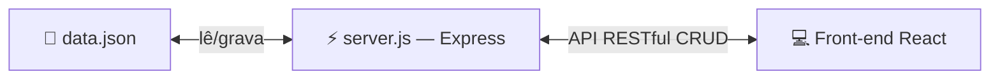
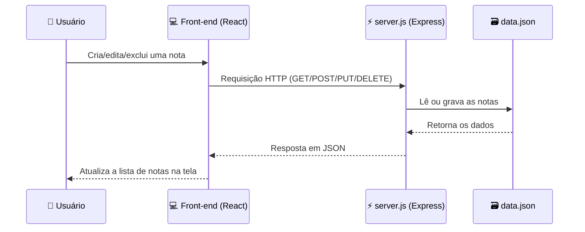
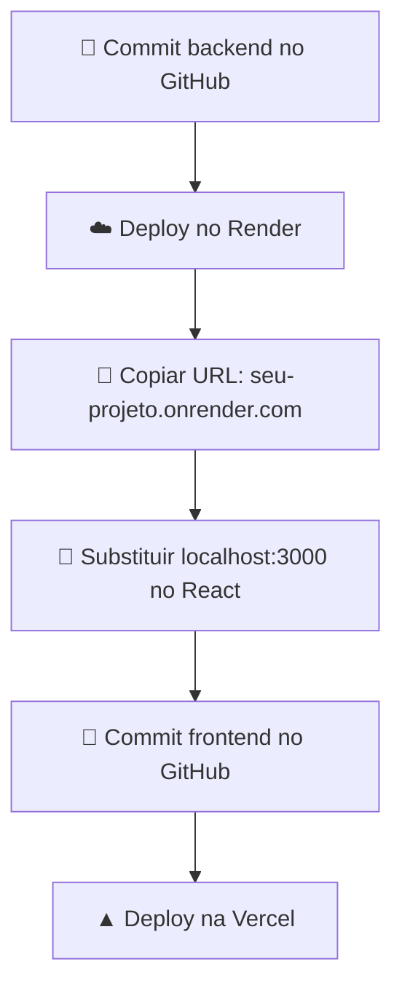

# 🗒️ Criando APIs para o Front-end — CRUD de Notas


**Disciplina:** Frameworks Front-end
**Professor:** Me. Deivison S. Takatu — deivison.takatu@edu.senai.br

---

## 📑 Índice

1. [Métodos HTTP](#-métodos-http)
2. [EndPoint](#-endpoint)
3. [JSON](#-json)
4. [Servidor Backend e Web Service](#-servidor-backend-e-web-service)
5. [Criando uma API REST com Express](#-criando-uma-api-rest-com-express)
6. [Evoluindo para um CRUD de notas](#-evoluindo-para-um-crud-de-notas)
7. [Rotas CRUD da aplicação](#-rotas-crud-da-aplicação)
8. [Implementação completa](#-implementação-completa)
9. [Fluxo da aplicação](#-fluxo-da-aplicação)
10. [Deploy (Backend + Frontend)](#-deploy-backend--frontend)
11. [Documentando a API com Postman](#-documentando-a-api-com-postman)
12. [Checklist das atividades](#-checklist-das-atividades)
13. [Questões para refletir](#-questões-para-refletir)
14. [Referências](#-referências)

---

## 📮 Métodos HTTP

| Método | Ícone | Finalidade | Idempotente? |
|---|---|---|---|
| `GET` | 📥 | Recuperar informações do servidor | ✅ Sim |
| `POST` | ➕ | Criar novos recursos | ❌ Não |
| `PUT` | 🔄 | Substituir completamente um recurso | ✅ Sim |
| `PATCH` | ✏️ | Atualizar parcialmente um recurso | ✅ Sim |
| `DELETE` | 🗑️ | Remover um recurso específico | ✅ Sim |

---

## 🎯 EndPoint

> [!NOTE]
> Um **endpoint** é uma URL específica que fornece acesso a um recurso ou funcionalidade de uma API — o ponto de comunicação entre cliente e servidor.

📚 Exemplo real: [awesomeapi-cep](https://github.com/awesomeapibrasil/awesomeapi-cep)

---

## 📦 JSON

**JSON** (*JavaScript Object Notation*) é um formato leve de troca de dados:

- 👀 Fácil de ler/escrever por humanos
- ⚙️ Fácil de parsear/gerar por máquinas
- 🧱 Estruturado em **objetos** (pares nome/valor) e **arrays** (listas ordenadas)

---

## 🏗️ Servidor Backend e Web Service

| Conceito | O que faz |
|---|---|
| 🖥️ **Servidor Backend** | Processa requisições, gerencia dados e responde aos clientes; armazena/recupera dados, executa regras de negócio e fornece APIs |
| 🌐 **Web Service** | Serviço acessível via HTTP/HTTPS que permite a sistemas heterogêneos se comunicarem de forma padronizada |

---

## ⚡ Criando uma API REST com Express

```bash
npm install express
npm install cors
```

```javascript
// api.js
import express from 'express';
import cors from 'cors';

const app = express();
app.use(cors());

app.get('/', (req, res) => {
  res.json({
    date: new Date().toLocaleString('pt-BR'),
    status: 'API no Render funcionando!'
  });
});

const PORT = process.env.PORT || 3000;
app.listen(PORT, () => {
  console.log(`Servidor rodando na porta ${PORT}`);
});
```

> [!WARNING]
> **CORS** é um mecanismo de segurança que controla o acesso entre domínios diferentes no navegador — sem ele, o front-end pode ser bloqueado ao consumir a API.

### ✅ Quando usar Express.js?

- [x] APIs REST eficientes e backends escaláveis
- [x] Servir páginas com templates e middlewares (auth, logs, erros)
- [ ] ~~Aplicações em tempo real~~ → prefira WebSockets
- [ ] ~~Processamento pesado~~ → use Workers

---

## 📝 Evoluindo para um CRUD de notas

> Em vez de apenas exibir data e hora de forma estática, o projeto evolui para uma aplicação que **armazena, visualiza, edita e exclui notas**, aplicando o conceito de **CRUD** (Create, Read, Update, Delete).

🔗 Demo: [notas-app-react.vercel.app](https://notas-app-react.vercel.app/)



---

## 🔀 Rotas CRUD da aplicação

| Rota | Método | Descrição |
|---|---|---|
| `/api/notes` | `GET` 📥 | Retorna todas as notas armazenadas |
| `/api/notes` | `POST` ➕ | Cria uma nova nota (`titulo`, `texto`, `id` gerado por `Date.now()`) |
| `/api/notes/:id` | `GET` 📥 | Retorna uma nota específica pelo ID |
| `/api/notes/:id` | `PUT` 🔄 | Atualiza uma nota existente pelo ID |
| `/api/notes/:id` | `DELETE` 🗑️ | Remove uma nota pelo ID (status 204) |

---

## 🛠️ Implementação completa

<details>
<summary>📦 Instalação</summary>

```bash
mkdir projeto-notas && cd projeto-notas
npm init -y
npm install express body-parser
```

> **Body-Parser** é a biblioteca que permite ao servidor ler dados enviados no corpo das requisições HTTP, como JSON em métodos POST e PUT.

</details>

<details>
<summary>⚡ server.js completo</summary>

```javascript
const express = require('express');
const bodyParser = require('body-parser');
const fs = require('fs');

const app = express();
const PORT = 3000;
const FILE = 'data.json';

app.use(bodyParser.json());

// Libera acesso externo (CORS)
app.use((req, res, next) => {
  res.header('Access-Control-Allow-Origin', '*');
  next();
});

function readNotes() {
  try {
    const data = fs.readFileSync(FILE);
    return JSON.parse(data);
  } catch {
    return [];
  }
}

function saveNotes(notes) {
  fs.writeFileSync(FILE, JSON.stringify(notes, null, 2));
}

// GET - Listar notas
app.get('/api/notes', (req, res) => {
  const notes = readNotes();
  res.json(notes);
});

// POST - Criar nota
app.post('/api/notes', (req, res) => {
  const notes = readNotes();
  const novaNota = {
    id: Date.now().toString(),
    titulo: req.body.titulo,
    texto: req.body.texto
  };
  notes.push(novaNota);
  saveNotes(notes);
  res.json(novaNota);
});

// PUT - Editar nota
app.put('/api/notes/:id', (req, res) => {
  const notes = readNotes();
  const index = notes.findIndex(n => n.id === req.params.id);
  if (index >= 0) {
    notes[index].titulo = req.body.titulo;
    notes[index].texto = req.body.texto;
    saveNotes(notes);
    res.json(notes[index]);
  } else {
    res.status(404).json({ erro: 'Nota não encontrada' });
  }
});

// DELETE - Excluir nota
app.delete('/api/notes/:id', (req, res) => {
  const notes = readNotes();
  const novasNotas = notes.filter(n => n.id !== req.params.id);
  saveNotes(novasNotas);
  res.json({ mensagem: 'Nota removida' });
});

app.listen(PORT, () => {
  console.log('Servidor rodando em http://localhost:3000');
});
```

</details>

<details>
<summary>🗃️ data.json de exemplo</summary>

```json
[
  {
    "id": "1",
    "titulo": "Lembretes",
    "texto": "Comprar leite e pão",
    "criadoEm": "2026-04-28T10:00:00Z"
  },
  {
    "id": "2",
    "titulo": "Tarefas do trabalho",
    "texto": "Enviar relatório até sexta-feira",
    "criadoEm": "2026-04-28T10:00:00Z"
  }
]
```

</details>

---

## 🔀 Fluxo da aplicação



---

## ☁️ Deploy (Backend + Frontend)



| Passo | Ação |
|---|---|
| 1️⃣ | Executar o servidor localmente: `node server.js` |
| 2️⃣ | Criar interface React para listar, cadastrar, editar e excluir notas |
| 3️⃣ | Publicar o back-end no **Render** |
| 4️⃣ | Conectar o front-end ao endpoint online do Render |
| 5️⃣ | Publicar o front-end na **Vercel** |

---

## 📖 Documentando a API com Postman

> [!NOTE]
> APIs normalmente são acompanhadas por uma **documentação técnica**: endpoints disponíveis, métodos HTTP suportados, parâmetros exigidos, formatos de resposta e exemplos de requisições.

**Postman** é uma ferramenta colaborativa que simplifica criar, testar, documentar e monitorar requisições HTTP.

- [x] Interface intuitiva para GET, POST, PUT, DELETE
- [x] Coleções de requisições organizadas e compartilháveis
- [x] Variáveis de ambiente, scripts pré-request e testes automatizados
- [x] Documentação automática + integração CI/CD via **Newman** (CLI do Postman)
- [x] Recursos avançados: Mock Servers, monitoramento, GraphQL, WebSockets, OAuth 2.0

---

## ✅ Checklist das atividades

### Atividade 01
- [ ] Atualizar o repositório da disciplina com todos os arquivos
- [ ] Verificar se todos os arquivos foram enviados corretamente
- [ ] Enviar o link do repositório via [formulário](https://forms.gle/L7iL7jx1RzyiXBnk9)

### Atividade 02
- [ ] Fazer deploy do back-end no Render
- [ ] Construir front-end que consuma o CRUD (criar, ver, editar, excluir notas)
- [ ] Criar uma coleção no Postman com as 4 operações CRUD
- [ ] Configurar requisições HTTP com parâmetros e descrições de códigos de resposta
- [ ] Documentar com prints do código, da aplicação funcionando e link da coleção Postman
- [ ] Enviar tudo via Canva

---

## 🤔 Questões para refletir

<details>
<summary>Ver as perguntas propostas pelo professor</summary>

- Quais são os riscos de segurança desse projeto e como poderiam ser eliminados ou mitigados?
- Usar um arquivo JSON (`data.json`) para armazenar notas é uma boa prática em produção? Quais as vantagens e desvantagens?
- Quais limitações um servidor baseado em arquivo JSON teria se o número de notas crescesse para 10.000 registros?
- O código atual está todo em `server.js`. Por que isso é problemático e como você melhoraria a organização da lógica?

</details>

---

## 📚 Referências

<details>
<summary>Ver lista completa de referências bibliográficas</summary>

1. SOUZA, Natan. *Bootstrap 4: conheça a biblioteca front-end mais utilizada no mundo.* São Paulo: Casa do Código, 2018.
2. MACHADO, Kheronn Khennedy. *Angular 11 e Firebase: construindo uma aplicação integrada com a plataforma do Google.* São Paulo: Casa do Código, 2021.
3. EIS, Diego. *Guia Front-end: o caminho das pedras para ser um dev front-end.* São Paulo: Casa do Código, 2015.
4. GONÇALVES, Edson. *Desenvolvendo aplicações Web com JSP, Servlets, JavaServer Faces, Hibernate, EJB 3 Persistence e Ajax.* Rio de Janeiro: Ciência Moderna, 2007.
5. HARTCOPP, Patrícia Ferreira. *Métrica Web.* São Paulo: Contentus, 2020.
6. NIEDERAUER, Juliano. *Desenvolvendo Websites com PHP.* 3. ed. São Paulo: Novatec, 2017.
7. PREECE, J.; ROGERS, Y.; SHARP, H. *Design de Interação: além da interação Homem-Computador.* 3. ed. Porto Alegre: Bookman, 2013.
8. SOUSA, Roque Fernando Marcos. *Canvas HTML 5: composição gráfica e interatividade na Web.* Rio de Janeiro: Brasport, 2014.

</details>

---

🎓 *Aula elaborada por Prof. Me. Deivison S. Takatu — SENAI*