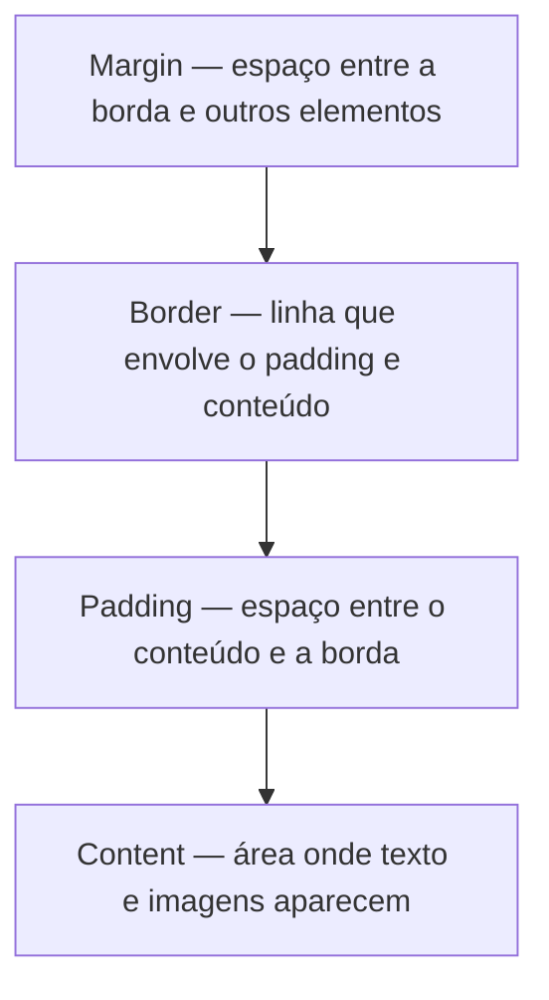
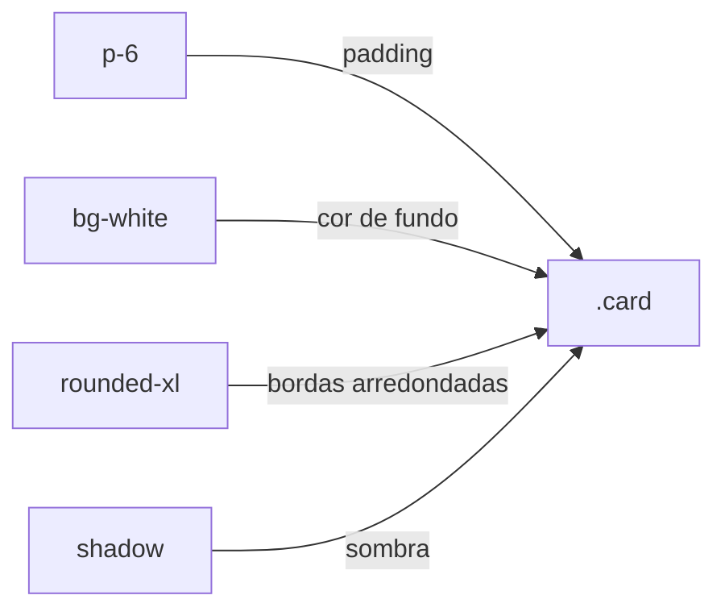

# 📘 Aula 07 — Frameworks CSS


> Resumo da aula sobre CSS (Cascading Style Sheets), Box Model, Flexbox, Layouts Responsivos e uma introdução ao Tailwind CSS.

## 📑 Índice

- [O que é CSS](#o-que-é-css)
- [Formas de aplicação do CSS](#formas-de-aplicação-do-css)
- [Principais propriedades](#principais-propriedades)
- [Class vs ID](#class-vs-id)
- [Box Model](#box-model)
- [Flexbox](#flexbox)
- [Layouts Responsivos](#layouts-responsivos)
- [Atividade 01](#-atividade-01)
- [Frameworks CSS](#frameworks-css)
- [Tailwind CSS](#tailwind-css)
- [Atividade 02](#-atividade-02)
- [Referências](#-referências)

---

## O que é CSS

CSS (*Cascading Style Sheets*) controla cores, fontes, margens, alinhamentos, larguras, alturas e elementos flutuantes, garantindo páginas organizadas e responsivas.

Estrutura básica:

```css
seletor {
  propriedade: valor;
}
```

- **Seletor**: indica em qual tag HTML a regra será aplicada.
- **Propriedade**: o atributo a ser modificado (ex: `background-color`).
- **Valor**: a configuração desejada (ex: `#FF0000`).

> [!NOTE]
> Muitas propriedades CSS substituem atributos antigos do HTML, como `bgcolor`, oferecendo mais flexibilidade e padronização.

---

## Formas de aplicação do CSS

| Tipo | Onde é definido | Quando usar |
|---|---|---|
| **In-line** | Atributo `style` no próprio elemento | Testes e ajustes pontuais |
| **Interno** | Dentro da tag `<style>` no `<head>` | Estilo usado em uma única página |
| **Externo** | Arquivo `.css` separado, ligado via `<link>` | Projetos maiores (mais recomendado) |

<details>
<summary>💻 Exemplos de código</summary>

```html
<!-- In-line -->
<p style="color: red; font-size: 20px;">Este é um texto em vermelho e maior</p>

<!-- Interno -->
<style>
  p { color: blue; font-size: 18px; }
</style>

<!-- Externo -->
<link rel="stylesheet" href="estilos.css">
```

</details>

> [!WARNING]
> O CSS externo é a forma mais recomendada para projetos com várias páginas: centraliza os estilos em um único arquivo, facilitando manutenção e consistência visual.

---

## Principais propriedades

- **color** — cor do texto (`color: red;`)
- **background-color** — cor de fundo (`background-color: blue;`)
- **font-family** — fonte usada (`font-family: Arial, sans-serif;`)
- **font-size** — tamanho do texto (`font-size: 16px;`)
- **margin** — espaço fora da borda do elemento
- **padding** — espaço dentro da borda, entre borda e conteúdo
- **border** — espessura, estilo e cor da borda
- **width / height** — dimensões do elemento
- **display** — como o elemento é renderizado (`block`, `inline`, `flex`)
- **position** — método de posicionamento (`static`, `relative`, `absolute`, `fixed`), combinado com `top`, `right`, `bottom`, `left`
- **text-align** — alinhamento horizontal do texto (`center`, `justify`)

<details>
<summary>💻 Exemplo completo (style.css)</summary>

```css
body {
  margin: 20px;
  padding: 0;
  background-color: #f0f0f0;
  font-family: Arial, sans-serif;
}

.exemplo {
  color: #ff0000;
  background-color: #0000ff;
  font-family: 'Courier New', monospace;
  font-size: 18px;
  margin: 20px;
  padding: 15px;
  border: 2px solid black;
  width: 300px;
  height: 200px;
  display: block;
  position: relative;
  top: 10px;
  left: 20px;
  text-align: center;
}
```
Fonte: [github.com/deivisontakatu/aula-css](https://github.com/deivisontakatu/aula-css)

</details>

---

## Class vs ID

- **Classes**: aplicam o mesmo estilo a múltiplos elementos → consistência visual e manutenção facilitada.
  ```css
  .botao-primario { background: blue; color: red; padding: 10px; }
  ```
- **IDs**: estilizam elementos únicos, permitem navegação via âncora e manipulação precisa via JavaScript.
  ```css
  #cabecalho-principal { height: 80px; background: #333; }
  ```

---

## Box Model



**Por que aplicar o Box Model?**
- Controlar o tamanho dos elementos
- Criar espaçamento e organização visual
- Evitar sobreposição e problemas de dimensionamento
- Construir layouts mais previsíveis
- Facilitar a adaptação para diferentes telas

---

## Flexbox

O Flexbox (*Flexible Box Layout*) é um módulo de layout unidimensional para organizar itens em linhas ou colunas, com distribuição de espaço e alinhamento.

| Propriedade | Valores comuns | Função |
|---|---|---|
| `flex-direction` | `row`, `column`, `row-reverse`, `column-reverse` | Define o eixo principal |
| `justify-content` | `flex-start`, `center`, `space-between`, `space-around` | Alinha itens no eixo principal |
| `align-items` | `flex-start`, `center`, `flex-end`, `stretch` | Alinha itens no eixo transversal |
| `flex-wrap` | `nowrap`, `wrap`, `wrap-reverse` | Controla quebra de linha |
| `gap` | valor em px | Espaçamento entre itens |

> [!NOTE]
> Sem `display: flex`, os elementos ficam em bloco (um abaixo do outro). Com `flex-direction: row`, ficam lado a lado; com `column`, voltam a se empilhar, mas já dentro do container flex.

---

## Layouts Responsivos

- Técnica de design que adapta o conteúdo para diferentes tamanhos de tela (celular, tablet, desktop).
- Melhora usabilidade e experiência do usuário.
- Reduz a necessidade de criar versões separadas para cada dispositivo.

```html
<meta name="viewport" content="width=device-width, initial-scale=1.0">
```

---

## ✅ Atividade 01

- [ ] Criar projeto com `index.html` e `style.css`, ligando o CSS de forma **externa** via `<link>`
- [ ] Adicionar 20 elementos com propriedades de **Content, Padding, Border e Margin**
- [ ] Adicionar 20 propriedades de **Flexbox** para organizar os elementos de forma responsiva

---

## Frameworks CSS

Um framework CSS é um conjunto de recursos, padrões, classes e componentes que facilita a criação e padronização de interfaces web (ex: Bootstrap, Tailwind, Materialize, Bulma, Foundation, Semantic UI, Pure).

**Componentes de um framework CSS:**
- **Layout** — grid, flexbox e responsividade
- **Estilos** — cores, espaços e tipografia
- **Componentes** — botões, cards e navbar

> [!WARNING]
> Sem um framework, cada botão, card, formulário e grid precisa ser estilizado manualmente do zero — o que aumenta bastante o tempo de desenvolvimento.

---

## Tailwind CSS

Framework CSS baseado no conceito **Utility-First**: em vez de componentes prontos, oferece pequenas classes utilitárias que representam propriedades de estilo isoladas, combinadas diretamente no HTML.



> Uma utility = uma responsabilidade. Várias utilities = um componente.

<details>
<summary>💻 Exemplo de botão com Tailwind</summary>

```html
<button class="bg-blue-600 text-white px-6 py-3 rounded-lg">
  Enviar
</button>
```

| Classe | Função |
|---|---|
| `bg-blue-600` | cor de fundo |
| `text-white` | cor do texto |
| `px-6 py-3` | padding horizontal e vertical |
| `rounded-lg` | bordas arredondadas |

</details>

**Propósitos do Tailwind:**
- Reduzir o tempo de desenvolvimento
- Aumentar a flexibilidade da interface
- Facilitar a customização (cores, espaçamentos, tipografia)
- Promover reutilização e consistência
- Simplificar o desenvolvimento responsivo (Mobile First)

**Formas de importar:**

<details>
<summary>💻 Play CDN (ideal para testes)</summary>

```html
<script src="https://cdn.jsdelivr.net/npm/@tailwindcss/browser@4"></script>
```

</details>

<details>
<summary>💻 Tailwind CLI</summary>

```bash
# 1. Instalar
npm install tailwindcss @tailwindcss/cli

# 2. Importar no CSS
@import "tailwindcss";

# 3. Integrar ao processo de build
npm install tailwindcss @tailwindcss/postcss postcss
```

> Frameworks como Next.js, Laravel, Angular e Ruby on Rails têm passos próprios de instalação.

</details>

> [!NOTE]
> A extensão **Tailwind CSS IntelliSense** (VS Code) autocompleta classes, mostra preview dos estilos e reduz erros de digitação.

---

## ✅ Atividade 02

- [ ] Criar projeto usando pelo menos **30 classes diferentes** do Tailwind CSS (cores, tipografia, espaçamentos, dimensões, bordas, posicionamento, flexbox, grid, responsividade)
- [ ] Documentar em markdown: prints do código, prints da aplicação funcionando, lista das classes usadas com suas funções e link do projeto
- [ ] Organizar a entrega em um repositório

---

## 📚 Referências

1. SOUZA, Natan. *Bootstrap 4: conheça a biblioteca front-end mais utilizada no mundo.* Casa do Código, 2018.
2. MACHADO, Kheronn Khennedy. *Angular 11 e Firebase.* Casa do Código, 2021.
3. EIS, Diego. *Guia Front-end: o caminho das pedras para ser um dev front-end.* Casa do Código, 2015.
4. GONÇALVES, Edson. *Desenvolvendo aplicações Web com JSP, Servlets, JavaServer Faces, Hibernate, EJB 3 Persistence e Ajax.* Ciência Moderna, 2007.
5. HARTCOPP, Patrícia Ferreira. *Métrica Web.* Contentus, 2020.
6. NIEDERAUER, Juliano. *Desenvolvendo Websites com PHP.* 3. ed. Novatec, 2017.
7. PREECE, J.; ROGERS, Y.; SHARP, H. *Design de Interação.* 3. ed. Bookman, 2013.
8. SOUSA, Roque Fernando Marcos. *Canvas HTML 5: composição gráfica e interatividade na Web.* Brasport, 2014.

---

**Fonte das aulas**: Prof. Me. Deivison S. Takatu — [github.com/deivisontakatu/aula-css](https://github.com/deivisontakatu/aula-css)